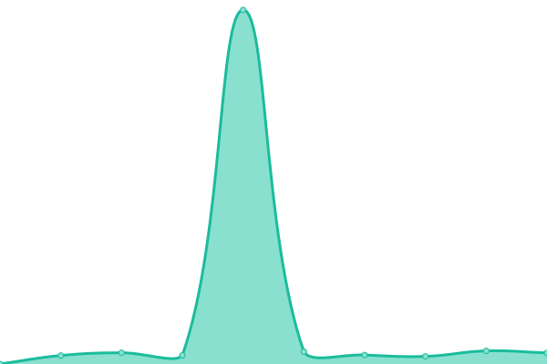

# [📈 Live Status](https://uptime.judilibre.io): <!--live status--> **🟧 Partial outage**

This repository contains the open-source uptime monitor and status page for [Upptime](https://upptime.js.org), powered by [Upptime](https://github.com/upptime/upptime).

With [Upptime](https://upptime.js.org), you can get your own unlimited and free uptime monitor and status page, powered entirely by a GitHub repository. We use [Issues](https://github.com/upptime/upptime/issues) as incident reports, [Actions](https://github.com/Cour-de-cassation/judilibre-uptime/actions) as uptime monitors, and [Pages](https://uptime.judilibre.io) for the status page.

<!--start: status pages-->
<!-- This summary is generated by Upptime (https://github.com/upptime/upptime) -->
<!-- Do not edit this manually, your changes will be overwritten -->
<!-- prettier-ignore -->
| URL | Status | History | Response Time | Uptime |
| --- | ------ | ------- | ------------- | ------ |
|  [www.courdecassation.fr recherche-judilibre](https://www.courdecassation.fr/recherche-judilibre) | 🟩 Up | [www-courdecassation-fr-recherche-judilibre.yml](https://github.com/Cour-de-cassation/judilibre-uptime/commits/HEAD/history/www-courdecassation-fr-recherche-judilibre.yml) | 

 1439ms
     
 | 

<a href="https://uptime.judilibre.io/history/www-courdecassation-fr-recherche-judilibre">100.00%</a>
    

|  [api.piste.gouv.fr healthcheck](https://api.piste.gouv.fr/cassation/judilibre/v1.0/healthcheck) | 🟩 Up | [api-piste-gouv-fr-healthcheck.yml](https://github.com/Cour-de-cassation/judilibre-uptime/commits/HEAD/history/api-piste-gouv-fr-healthcheck.yml) | 

 1232ms
     
 | 

<a href="https://uptime.judilibre.io/history/api-piste-gouv-fr-healthcheck">100.00%</a>
    

|  [search.judilibre.io healthcheck](https://search.judilibre.io/healthcheck) | 🟥 Down | [search-judilibre-io-healthcheck.yml](https://github.com/Cour-de-cassation/judilibre-uptime/commits/HEAD/history/search-judilibre-io-healthcheck.yml) | 

 1051ms
     
 | 

<a href="https://uptime.judilibre.io/history/search-judilibre-io-healthcheck">99.76%</a>
    

|  [search.prod-par2.judilibre.io healthcheck](https://search.prod-par2.judilibre.io/healthcheck) | 🟥 Down | [search-prod-par2-judilibre-io-healthcheck.yml](https://github.com/Cour-de-cassation/judilibre-uptime/commits/HEAD/history/search-prod-par2-judilibre-io-healthcheck.yml) | 

 1006ms
     
 | 

<a href="https://uptime.judilibre.io/history/search-prod-par2-judilibre-io-healthcheck">78.08%</a>
    

|  [search.prod-par1.judilibre.io healthcheck](https://search.prod-par1.judilibre.io/healthcheck) | 🟥 Down | [search-prod-par1-judilibre-io-healthcheck.yml](https://github.com/Cour-de-cassation/judilibre-uptime/commits/HEAD/history/search-prod-par1-judilibre-io-healthcheck.yml) | 

 968ms
     
 | 

<a href="https://uptime.judilibre.io/history/search-prod-par1-judilibre-io-healthcheck">99.86%</a>
    

|  [search.dev.judilibre.io healthcheck](https://search.dev.judilibre.io/healthcheck) | 🟥 Down | [search-dev-judilibre-io-healthcheck.yml](https://github.com/Cour-de-cassation/judilibre-uptime/commits/HEAD/history/search-dev-judilibre-io-healthcheck.yml) | 

 989ms
     
 | 

<a href="https://uptime.judilibre.io/history/search-dev-judilibre-io-healthcheck">0.00%</a>
    

|  [sandbox-api.piste.gouv.fr healthcheck](https://sandbox-api.piste.gouv.fr/cassation/judilibre/v1.0/healthcheck) | 🟩 Up | [sandbox-api-piste-gouv-fr-healthcheck.yml](https://github.com/Cour-de-cassation/judilibre-uptime/commits/HEAD/history/sandbox-api-piste-gouv-fr-healthcheck.yml) | 

 1347ms
     
 | 

<a href="https://uptime.judilibre.io/history/sandbox-api-piste-gouv-fr-healthcheck">97.52%</a>
    

<!--end: status pages-->

[**Visit our status website →**](https://uptime.judilibre.io)

## 📄 License

- Powered by: [Upptime](https://github.com/upptime/upptime)
- Code: [MIT](./LICENSE) © [Upptime](https://upptime.js.org)
- Data in the `./history` directory: [Open Database License](https://opendatacommons.org/licenses/odbl/1-0/)
